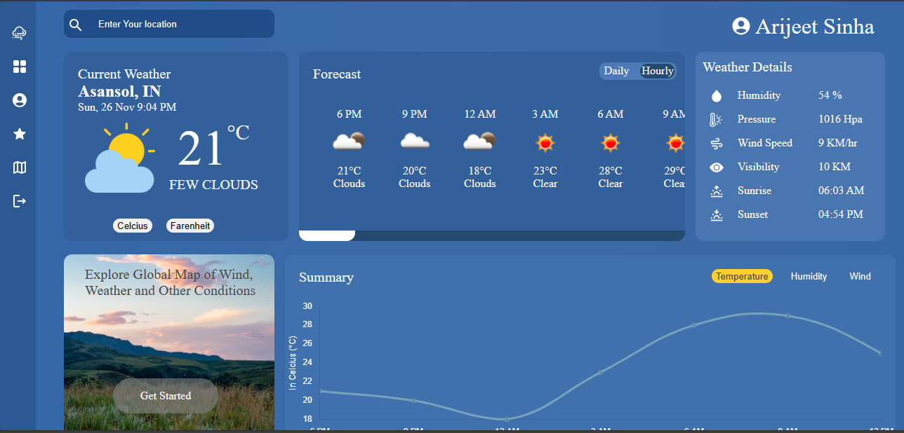

##  Wiindy - Weather Forecast App




## Overview

Wiindy is a modern weather forecast app built using ReactJS with Vite as the bundler. This user interface repository focuses on the frontend aspects of the application. Wiindy provides users with accurate and up-to-date weather information, including the current weather based on their location, 5-day forecasting, interactive maps, and detailed weather charts. Additionally, users can personalize their experience by adding favorite cities to their profile.

## Table of Contents

- [Features](#features)
- [Technologies Used](#technologies-used)
- [Installation](#installation)
- [Configuration](#configuration)
- [Usage](#usage)
- [Deployment](#deployment)

## Features

1. **Current Weather**: Get real-time weather updates based on the user's current location.
2. **5-Day Forecasting**: Plan ahead with a 5-day weather forecast.
3. **Interactive Map**: Explore weather patterns using an interactive map.
4. **Weather Charts**: View detailed weather charts for better insights.
5. **Authentication**: Secure user authentication using Firebase.
6. **Favorite Cities**: Users can add and manage their favorite cities for quick access to weather information.

## Technologies Used

- **Frontend**: ReactJS with Vite
- **Authentication**: Firebase
- **Weather Data**: OpenWeatherMap API

## Installation

1. Clone the repository:

   ```bash
   git clone https://github.com/your-username/wiindy-ui.git

2. Navigate to Project:

   ```bash
   cd wiindy-ui

3. Install Dependencies:

   ```bash
   npm install

## Configuration 

1. Create a Firebase project and set up authentication.
2. Obtain an API key from OpenWeatherMap for accessing weather data.
3. Configure the app by creating a .env file in the root of the project:

    VITE_REACT_APP_WEATHERAPI_KEY = Your-weather-api-key


## Usage

1. Start developemnet server :

    ```bash
   npm run dev

2. Open your browser and navigate to http://localhost:5173 to view the app.


## Deployment

Deplyed at Vercel app : https://wiindy-ui.vercel.app.

## Backend API 

https://github.com/Arijeet2302/wiindy-backend.git